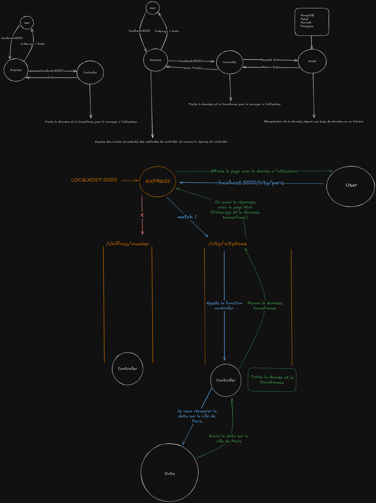

# StyleCheats  JS
- [StyleCheats  JS](#stylecheats--js)
  - [Definition des variables](#definition-des-variables)
  - [Conditions](#conditions)
      - [Opérateurs de comparaison dans les conditions](#opérateurs-de-comparaison-dans-les-conditions)
      - [ET et OU Logiques](#et-et-ou-logiques)
  - [Boucles](#boucles)
      - [Boucle itérative](#boucle-itérative)
      - [Boucle while](#boucle-while)
      - [Boucle for of](#boucle-for-of)
      - [Boucle for in](#boucle-for-in)
      - [Boucle forEach](#boucle-foreach)
      - [Break et Continue](#break-et-continue)
  - [Fonctions](#fonctions)
      - [Fonction nommée](#fonction-nommée)
      - [Fonction anonyme](#fonction-anonyme)
      - [Fonction fléchée](#fonction-fléchée)
      - [Fonction avec paramètres (arguments)](#fonction-avec-paramètres-arguments)
      - [Fonction avec valeur de retour](#fonction-avec-valeur-de-retour)
      - [Fonction fléchée avec valeur de retour](#fonction-fléchée-avec-valeur-de-retour)
      - [Fonction avec paramètres et valeur de retour](#fonction-avec-paramètres-et-valeur-de-retour)
      - [Fonction fléchée avec paramètres et valeur de retour](#fonction-fléchée-avec-paramètres-et-valeur-de-retour)
      - [Fonction avec paramètres par défaut](#fonction-avec-paramètres-par-défaut)
  - [Objets](#objets)
      - [Création d'un objet et accès aux propriétés](#création-dun-objet-et-accès-aux-propriétés)
      - [Modification propriétés d'un objet](#modification-propriétés-dun-objet)
      - [Ajout d'une propriété à un objet](#ajout-dune-propriété-à-un-objet)
  - [Tableaux](#tableaux)
      - [Création d'un tableau et accès aux éléments](#création-dun-tableau-et-accès-aux-éléments)
      - [Ajout d'éléments à un tableau](#ajout-déléments-à-un-tableau)
      - [Suppression d'un élément a la fin du tableau](#suppression-dun-élément-a-la-fin-du-tableau)
      - [Ajout d'un élément au début du tableau](#ajout-dun-élément-au-début-du-tableau)
      - [Suppression du premier élément du tableau](#suppression-du-premier-élément-du-tableau)
      - [Recherche d'un élément dans un tableau](#recherche-dun-élément-dans-un-tableau)
      - [Suppression d'un élément à un index donné](#suppression-dun-élément-à-un-index-donné)
      - [Copie d'un tableau](#copie-dun-tableau)
      - [Concaténation de tableaux](#concaténation-de-tableaux)
      - [Filtrer un tableau](#filtrer-un-tableau)
      - [Find dans un tableau](#find-dans-un-tableau)
  - [Strings](#strings)
      - [Concaténation de chaînes de caractères](#concaténation-de-chaînes-de-caractères)
      - [Interpolation de chaînes de caractères (Concaténation)](#interpolation-de-chaînes-de-caractères-concaténation)
      - [Recherche d'une caractère dans une chaîne de caractères](#recherche-dune-caractère-dans-une-chaîne-de-caractères)
      - [Extraction de caractères dans une chaîne de caractères](#extraction-de-caractères-dans-une-chaîne-de-caractères)
      - [Remplacer un caractère ou plusieur caractères dans une chaîne de caractères](#remplacer-un-caractère-ou-plusieur-caractères-dans-une-chaîne-de-caractères)
      - [Mettre un chaine de caractères en majuscules](#mettre-un-chaine-de-caractères-en-majuscules)
      - [Mettre un chaine de caractères en minuscules](#mettre-un-chaine-de-caractères-en-minuscules)
      - [Suppression des espaces dans une chaines de caractères](#suppression-des-espaces-dans-une-chaines-de-caractères)
      - [Mettre une chaines de caractères dans un tableau](#mettre-une-chaines-de-caractères-dans-un-tableau)
      - [Savoir la longueur d'une chaine de caractères](#savoir-la-longueur-dune-chaine-de-caractères)
      - [Extraction d'un caractère](#extraction-dun-caractère)
      - [Conversion de String en Number](#conversion-de-string-en-number)
      - [Conversion de String en Float](#conversion-de-string-en-float)
      - [Conversion de Number en String](#conversion-de-number-en-string)
  - [Modules](#modules)
      - [Exporter un module (deux methodes)](#exporter-un-module-deux-methodes)
      - [Importer un module](#importer-un-module)
      - [NPM](#npm)
        - [Explications NPM](#explications-npm)
        - [Fonctionnement et Commandes](#fonctionnement-et-commandes)
  - [MVC](#mvc)


## Definition des variables
```javascript

// This is a comment
var maVarVariable = 7; // Cette variables est modifiable (déprécié)
let maLetVariable = 7; // Cette variables est modifiable
const maConstVariable = 7 // Cette variables n'est pas modifiable
```

## Conditions
```javascript
const maConstVariable = 7;

// Si maConstVariable est égale à 7
if (maConstVariable === 7) {
  console.log('maConstVariable est égale à 7');
} 
// Sinon si maConstVariable est supérieur à 7
else if (maConstVariable > 7) { 
  console.log('maConstVariable est supérieur à 7');
}
// Alors
else { 
  console.log('maConstVariable n\'est pas égale à 7');
}
```
#### Opérateurs de comparaison dans les conditions

| Opérateur | Description                                    | Exemple             | Résultat |
|-----------|------------------------------------------------|---------------------|----------|
| `==`      | Égal à (vérifie la valeur, pas le type)        | `5 == '5'`          | `true`   |
| `===`     | Strictement égal (vérifie la valeur et le type)| `5 === '5'`         | `false`  |
| `!=`      | Différent de (vérifie la valeur, pas le type)  | `5 != '6'`          | `true`   |
| `!==`     | Strictement différent (vérifie la valeur et le type) | `5 !== '5'` | `true`   |
| `<`       | Inférieur à                                    | `5 < 10`            | `true`   |
| `<=`      | Inférieur ou égal à                           | `5 <= 5`            | `true`   |
| `>`       | Supérieur à                                    | `10 > 5`            | `true`   |
| `>=`      | Supérieur ou égal à                           | `10 >= 10`          | `true`   |

#### ET et OU Logiques
```javascript
// Vous avez aussi les ET et OU logiques
const maConstVariable = 7;

// Si maConstVariable est égale à 7 et supérieur à 5
if (maConstVariable === 7 && maConstVariable > 5) {
  console.log('maConstVariable est égale à 7 et supérieur à 5');
}

// Si maConstVariable est égale à 7 ou supérieur à 5
if (maConstVariable === 7 || maConstVariable > 5) {
  console.log('maConstVariable est égale à 7 ou supérieur à 5');
}
```

## Boucles
#### Boucle itérative
```javascript
// Boucle itérative
const maConstVariable = 7;

// Boucle avec un nombre de répétition fixe (7)
for (let i = 0; i < maConstVariable; i++) {
  console.log(i);
}

// Schematisation 
for(Initialisation; Condition; Incrémentation) {
  // Code à répéter
}
```
#### Boucle while
```javascript
// Boucle while

// Situation d'utilisation
// Utilisé pour répéter une action tant qu'une condition est vraie 
// (Rarement utilisé ou pour des utilisation très spécifique)
let i = 0;

while (i < 7) {
  console.log(i); // Affiche 0, 1, 2, 3, 4, 5, 6
  i++; // Incrémente i (On ajoute 1 à i à chaque tour de boucle)
}

// Schematisation
while (Condition) {
  // Code à répéter
}
```
#### Boucle for of
```javascript
// Boucle for of

// Situation d'utilisation

// Spécifiquement utilisé pour parcourir des objets itérables
// Comme les tableaux, chaînes de caractères, ou les objets avec un itérateur défini.

const fruits = ['Pomme', 'Banane', 'Orange'];
for (const fruit of fruits) {
  console.log(fruit); // Affiche Pomme, Banane, Orange
}

// Schematisation
for (const element of tableau) {
  // Code à répéter
}
```
#### Boucle for in
```javascript
// Boucle for in

// Situation d'utilisation
// Utilisé pour parcourir les propriétés d'un objet (exemple : nom, âge, ville)

//⚠️ Attention : for in ne doit pas être utilisé pour parcourir un tableau UNIQUEMENT UN OBJET.

const utilisateur = { nom: 'Alice', âge: 25, ville: 'Paris' };
for (const clé in utilisateur) {
  console.log(clé, utilisateur[clé]); // Affiche nom Alice, âge 25, ville Paris
}

// Schematisation
for (const clé in objet) {
  // Code à répéter
}
```
#### Boucle forEach
```javascript

// Boucle forEach

// Situation d'utilisation
// Utilisé pour parcourir les éléments d'un tableau

//⚠️ Attention : forEach  ne doit pas être utilisé pour parcourir un tableau UNIQUEMENT UN OBJET.

const fruits = ['Pomme', 'Banane', 'Orange'];

fruits.forEach((fruit) => {
  console.log(fruit); // Affiche Pomme, Banane, Orange
});

// Schematisation
tableau.forEach((élément) => {
  // Code à répéter
});
```
#### Break et Continue
```javascript
// Vous pouvez aussi rencontrès dans vos boucles des mots clés comme break et continue

// Break
// Utilisé pour arrêter une boucle

for (let i = 0; i < 7; i++) {
  if (i === 3) {
    break; // Arrête la boucle si la contion est vraie
  }
  console.log(i); // Affiche 0, 1, 2
}

// Continue

// Utilisé pour passer à l'itération suivante d'une boucle

for (let i = 0; i < 7; i++) {
  if (i === 3) {
    continue; // Passe à l'itération suivante si la condition est vraie
  }
  console.log(i); // Affiche 0, 1, 2, 4, 5, 6
}
```


## Fonctions
#### Fonction nommée
```javascript
// Fonction nommée
function maFonction() {
  console.log('Hello World');
}

// Appel de la fonction
maFonction(); // Affiche Hello World
```
#### Fonction anonyme
```javascript
// Fonction anonyme
const maFonction = function() {
  console.log('Hello World');
}

// Appel de la fonction
maFonction(); // Affiche Hello World
```
#### Fonction fléchée
```javascript
// Fonction fléchée
const maFonction = () => {
  console.log('Hello World');
}

// Appel de la fonction
maFonction(); // Affiche Hello World
```
#### Fonction avec paramètres (arguments)
```javascript
// Fonction avec paramètres
function maFonction(param1, param2) {
  console.log(param1, param2);
}

// Appel de la fonction
maFonction('Hello', 'World'); // Affiche Hello World
```
#### Fonction avec valeur de retour
```javascript
// Fonction avec valeur de retour
function maFonction() {
  return 'Hello World';
}

// Appel de la fonction
const resultat = maFonction();
console.log(resultat); // Affiche Hello World
```
#### Fonction fléchée avec valeur de retour
```javascript
// Fonction fléchée avec valeur de retour
const maFonction = () => 'Hello World';

// Appel de la fonction
const resultat = maFonction();
console.log(resultat); // Affiche Hello World
```
#### Fonction avec paramètres et valeur de retour
```javascript
// Fonction avec paramètres et valeur de retour
function maFonction(param1, param2) {
  return param1 + ' ' + param2;
}

// Appel de la fonction

const resultat = maFonction('Hello', 'World');

console.log(resultat); // Affiche Hello World
```
#### Fonction fléchée avec paramètres et valeur de retour
```javascript

// Fonction fléchée avec paramètres et valeur de retour

const maFonction = (param1, param2) => param1 + ' ' + param2;

// Appel de la fonction
const resultat = maFonction('Hello', 'World');

console.log(resultat); // Affiche Hello World
```
#### Fonction avec paramètres par défaut
```javascript
// Fonction avec paramètres par défaut
function maFonction(param1 = 'Hello', param2 = 'World') {
  console.log(param1, param2);
}

// Appel de la fonction
maFonction(); // Affiche Hello World
maFonction('Bonjour'); // Affiche Bonjour World
maFonction('Bonjour', 'Monde'); // Affiche Bonjour Monde
```

## Objets
#### Création d'un objet et accès aux propriétés
```javascript
// Création d'un objet
const utilisateur = {
  nom: 'Alice',
  âge: 25,
  ville: 'Paris'
};

// Accès aux propriétés de l'objet (vous avez deux façons de faire)
console.log(utilisateur.nom); // Affiche Alice
console.log(utilisateur['âge']); // Affiche 25
```
#### Modification propriétés d'un objet
```javascript
let utilisateur = {
  nom: 'Alice',
  âge: 25,
  ville: 'Paris'
};

// Modification d'une propriété de l'objet
utilisateur.nom = 'Bob';
console.log(utilisateur.nom); // Affiche Bob
```
#### Ajout d'une propriété à un objet
```javascript
let utilisateur = {
  nom: 'Alice',
  âge: 25,
  ville: 'Paris'
};

// Ajout d'une propriété à l'objet
utilisateur.email = 'alice@paris.com'

console.log(utilisateur.email); // Affiche alice@paris.com
```

## Tableaux
#### Création d'un tableau et accès aux éléments
```javascript
// Création d'un tableau
const fruits = ['Pomme', 'Banane', 'Orange'];

// Accès aux éléments du tableau
console.log(fruits[0]); // Affiche Pomme
console.log(fruits[1]); // Affiche Banane
console.log(fruits[2]); // Affiche Orange
```
#### Ajout d'éléments à un tableau
```javascript
// Ajout d'un élément à la fin du tableau
const fruits = ['Pomme', 'Banane', 'Orange'];
fruits.push('Fraise');

console.log(fruits); // Affiche ['Pomme', 'Banane', 'Orange', 'Fraise']
```
#### Suppression d'un élément a la fin du tableau
```javascript
// Suppression du dernier élément du tableau
const fruits = ['Pomme', 'Banane', 'Orange'];
fruits.pop();

console.log(fruits); // Affiche ['Pomme', 'Banane']
```
#### Ajout d'un élément au début du tableau
```javascript
// Ajout d'un élément au début du tableau
const fruits = ['Pomme', 'Banane', 'Orange'];
fruits.unshift('Fraise');

console.log(fruits); // Affiche ['Fraise', 'Pomme', 'Banane', 'Orange']
```
####  Suppression du premier élément du tableau
```javascript
// Suppression du premier élément du tableau
const fruits = ['Pomme', 'Banane', 'Orange'];
fruits.shift();

console.log(fruits); // Affiche ['Banane', 'Orange']
```
#### Recherche d'un élément dans un tableau
```javascript
// Recherche d'un élément dans un tableau
const fruits = ['Pomme', 'Banane', 'Orange'];
const index = fruits.indexOf('Banane');

console.log(index); // Affiche 1
```
#### Suppression d'un élément à un index donné
```javascript
// Suppression d'un élément à un index donné
const fruits = ['Pomme', 'Banane', 'Orange'];
fruits.splice(1, 1);

console.log(fruits); // Affiche ['Pomme', 'Orange']
```
#### Copie d'un tableau
```javascript
// Copie d'un tableau
const fruits = ['Pomme', 'Banane', 'Orange'];
const copieFruits = fruits.slice();

console.log(copieFruits); // Affiche ['Pomme', 'Banane', 'Orange']
```
#### Concaténation de tableaux
```javascript
// Concaténation de tableaux
const fruits1 = ['Pomme', 'Banane'];
const fruits2 = ['Orange', 'Fraise'];
const fruits = fruits1.concat(fruits2);

console.log(fruits); // Affiche ['Pomme', 'Banane', 'Orange', 'Fraise']
```
#### Filtrer un tableau
```javascript
// Filtrer un tableau
const nombres = [1, 2, 3, 4, 5];
const nombresPairs = nombres.filter(nombre => nombre % 2 === 0);

console.log(nombresPairs); // Affiche [2, 4]
```
#### Find dans un tableau
```javascript
// Find dans un tableau
const fruits = ['Pomme', 'Banane', 'Orange'];
const fruit = fruits.find(fruit => fruit === 'Banane');

console.log(fruit); // Affiche Banane
```

## Strings
#### Concaténation de chaînes de caractères
```javascript
// Concaténation de chaînes de caractères
const prenom = 'Alice';
const nom = 'Dupont';
const nomComplet = prenom + ' ' + nom;

console.log(nomComplet); // Affiche Alice Dupont
```
#### Interpolation de chaînes de caractères (Concaténation)
```javascript
// Interpolation de chaînes de caractères
const prenom = 'Alice';
const nom = 'Dupont';
const nomComplet = `${prenom} ${nom}`;

console.log(nomComplet); // Affiche Alice Dupont
```
#### Recherche d'une caractère dans une chaîne de caractères
```javascript
// Recherche d'une sous-chaîne
const phrase = 'Bonjour tout le monde';
const index = phrase.indexOf('tout');

console.log(index); // Affiche 8
```
#### Extraction de caractères dans une chaîne de caractères
```javascript
// Extraction d'une sous-chaîne
const phrase = 'Bonjour tout le monde';
const sousPhrase = phrase.slice(8, 12);

console.log(sousPhrase); // Affiche tout
```
#### Remplacer un caractère ou plusieur caractères dans une chaîne de caractères
```javascript
// Remplacement d'une sous-chaîne
const phrase = 'Bonjour tout le monde';
const nouvellePhrase = phrase.replace('tout', 'à tous');

console.log(nouvellePhrase); // Affiche Bonjour à tous le monde
```
#### Mettre un chaine de caractères en majuscules
```javascript
// Conversion en majuscules
const phrase = 'Bonjour tout le monde';
const phraseMajuscules = phrase.toUpperCase();

console.log(phraseMajuscules); // Affiche BONJOUR TOUT LE MONDE
```
#### Mettre un chaine de caractères en minuscules
```javascript
// Conversion en minuscules
const phrase = 'Bonjour tout le monde';
const phraseMinuscules = phrase.toLowerCase();

console.log(phraseMinuscules); // Affiche bonjour tout le monde
```
#### Suppression des espaces dans une chaines de caractères
```javascript
// Suppression des espaces au début et à la fin
const phrase = ' Bonjour tout le monde ';
const phraseSansEspaces = phrase.trim();

console.log(phraseSansEspaces); // Affiche Bonjour tout le monde
```
#### Mettre une chaines de caractères dans un tableau
```javascript
// Séparation en tableau
const phrase = 'Bonjour tout le monde';
const mots = phrase.split(' ');

console.log(mots); // Affiche ['Bonjour', 'tout', 'le', 'monde']
```
#### Savoir la longueur d'une chaine de caractères
```javascript
// Longueur d'une chaîne de caractères
const phrase = 'Bonjour tout le monde';

console.log(phrase.length); // Affiche 20
```
#### Extraction d'un caractère
```javascript
// Extraction d'un caractère
const phrase = 'Bonjour tout le monde';

console.log(phrase[0]); // Affiche B
```
#### Conversion de String en Number
```javascript
// Conversion en nombre
const nombre = '42';
const nombreEntier = parseInt(nombre);

console.log(nombreEntier); // Affiche 42
```
#### Conversion de String en Float
```javascript
// Conversion en nombre à virgule flottante
const nombre = '3.14';
const nombreDecimal = parseFloat(nombre);

console.log(nombreDecimal); // Affiche 3.14
```
#### Conversion de Number en String
```javascript
// Conversion en chaîne de caractères
const nombre = 42;
const nombreEnString = nombre.toString();

console.log(nombreEnString); // Affiche '42'
```

## Modules
#### Exporter un module (deux methodes)
```javascript
// Exporter un module
export const testModule = {
  testFunction: () => {
    console.log('Hello World');
  }
}
```

```javascript
// Exporter un module
const testModule = {
  testFunction: () => {
    console.log('Hello World');
  }
}

export default testModule;
```

#### Importer un module
⚠️ **Attention** : Pour importer des modules dans un fichier JavaScript il faut que dans votre `package.json` vous ayez `"type": "module"`.
```javascript
// Importer un module
import testModule from './testModule.js';

testModule.testFunction(); // Affiche Hello World
```
**Sinon** vous devrez utiliser les `require` pour importer vos modules
```javascript
// Importer un module
const testModule = require('./testModule.js');

testModule.testFunction(); // Affiche Hello World
```

#### NPM
##### Explications NPM
- **Gestionnaire de dépendences**: Il permet de télécharger, installer, mettre à jour et supprimer des library *(libs/dépendences/paquets)* dans vos projets JavaScript.
- **NPM** a besoin d'un fichier `package.json` pour fonctionner dans ce fichier vous avez toutes les informations sur les dépendances de votre projet *(nom et  version des dépendences)*.
##### Fonctionnement et Commandes
- Pour **initialiser** un projet NPM vous devez utiliser la commande 
  - `npm init`

- Pour **installer une dépendences** vous devez utiliser la commande 
  - `npm install nomDuPaquet`

- Pour **installer les dépendances d'un projet déjà existant** vous devez utiliser la commande 
  - `npm install` *(Nécessite déjà la présence d'un fichier `package.json` dans le projet)*

- Pour **désinstaller une dépendences** vous devez utiliser la commande :
  - `npm uninstall nomDuPaquet`

- Pour **mettre à jour une dépendences** vous devez utiliser la commande 
   - `npm update nomDuPaquet`

- Pour **voir les dépendences installés** vous devez utiliser la commande `npm list`

## MVC
